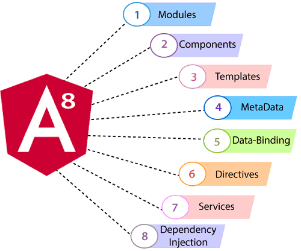
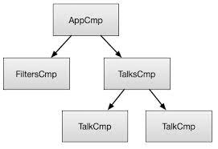
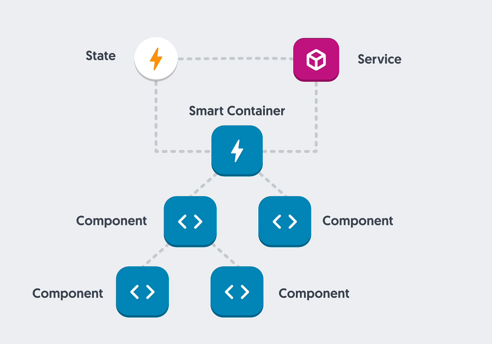

#### Architecture

- what makes up and angular application architecture
  

- also `Router`, `Pipe`

#### Concepts

- have three concepts
    - `Component Architecture`
    - `State`
    - `One-way data flow`

- Component Architecture
    - Component design and composition
    - Passing state and events
    - Encapsulating local state
    - Parent and child communication
    - Smart and Dumb roles
    - One-way data flow

- Immutable state + State management
    - App state is stored dats over time
    - State is often abstracted and managed by a Stora
    - Single or multiple state trees
    - Immutable data structures and update patterns
    - Performance boost via identity checks

- One-way data flow
    - Easier to track app state changes
    - More intelligent rendering
    - Clearer code intent and architecture patterns
    - Less code maintenance
    - Data down, changes up

**Component Architecture**

- Smart container
    - Contains and wires up childComponents
    - State in and out via Services
    - Passes state to child Components
    - Listens to events from child Components
    - Frequently used in Routes
    - Not very reusable

- Smart container
    - Primarily though a smart container is in charge of grabbing the data and then composing and hooking it all in to
      our dumb components

- Dumb Component
    - Renders HTML and state for presentation
    - State in and out via @Input and @Output properties
    - Is given state from parent Components
    - Emits state changes to parent Components via events
    - Not used in Routes
    - Highly reusable

